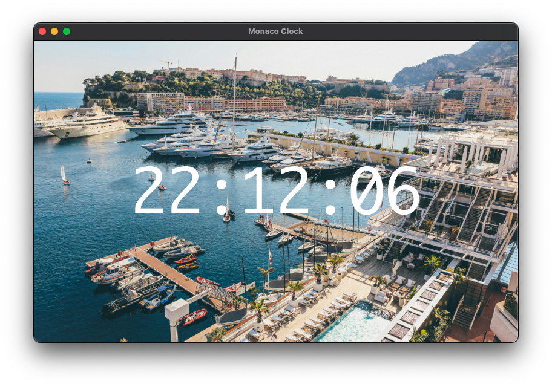

# Monaco Clock



## Overview

Monaco Clock is a simple desktop application that displays the current time in a visually appealing format. The application is built using Python with the PyQt6 framework and QML for the user interface. It features a beautiful background of Monaco and updates the time every second.

## Features

Displays the current time in HH:MM:SS
format.
Updates in real-time every second.
Aesthetic desert background image.
Frameless window option for a clean look.

## Technologies Used

Python: Programming language used for backend logic.
PyQt6: Framework for building the desktop application.
QML: Language used for designing the user interface.

## Installation
### Prerequisites
Before running the application, ensure you have the following installed:

- Python 3.8 or higher
- PyQt6

### Setting Up the Environment

1. Clone the repository or download the source code.

   ```bash
   git clone https://github.com/sushiroll-206/pythonDesktopApplication.git
   cd pythonDesktopApplication
   ```
2. Create a virtual environment

    ```bash
    python3 -m venv venv
    sourec venv/bin/activate
    ```
3. Install required packages
    ```bash
    pip install PyQt6
    ```
### Running the Application
1. Ensure you have all necessary assets
2. Run the application
    ```bash
    python3 main.py
    ```
### Building the Application
If you wish to build the application into an executable

1. Make sure you have PyInstaller installed. 
    ```bash
    pip install pyinstaller
    ```
2. Build the application
    ```bash 
    pyinstaller main.spec
    ```
3. After building, find the executable in the dist/main directory
